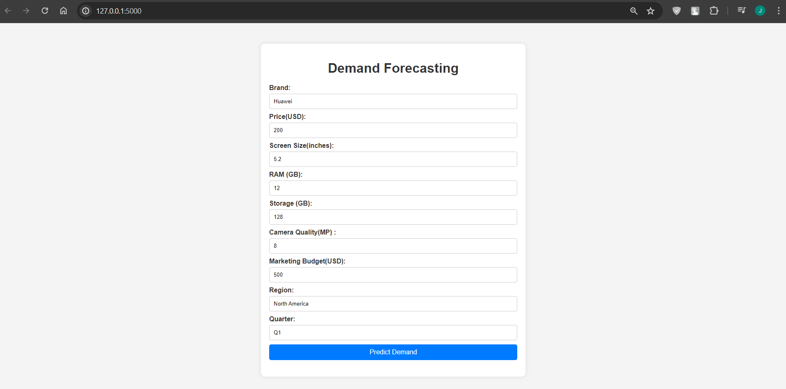
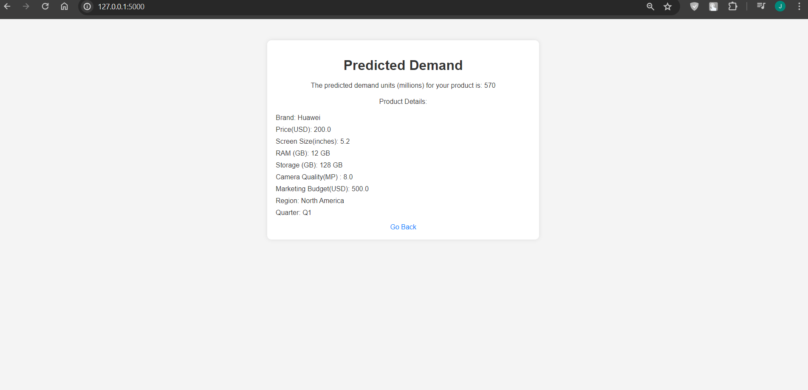

# Mobile Phone Demand Forecasting

This project aims to build a machine learning model to predict the demand for mobile phones based on various features such as brand, price, screen size, RAM, storage, camera quality, marketing budget, region, and quarter.

## Project Overview

The project uses Python and popular data science libraries like Pandas, NumPy, and Scikit-learn. Random data is generated for 10,000 instances with different combinations of features and units sold (in millions). This data is then used to train a machine learning model for demand forecasting.

The user interface (UI) is a simple web application built using HTML, CSS, and JavaScript. It allows users to input the product details, and the trained model predicts the demand (units sold in millions) for the given input.

## Getting Started

To run this project locally, follow these steps:

1. Clone the repository:
   ```
   git clone https://github.com/your-username/mobile-demand-forecasting.git
   ```

2. Install the required Python packages:
   ```
   pip install pandas numpy scikit-learn
   ```

3. Run the `app.py` file to start the local server:
   ```
   python app.py
   ```

4. Open your web browser and navigate to `http://localhost:5000` to access the UI.

5. Enter the product details in the provided form and click the "Predict Demand" button to see the predicted demand.

## Project Structure

```
mobile-demand-forecasting/
├── app.py
├── data/
│   └── data.csv
├── model/
│   └── model.pkl
├── static/
│   ├── css/
│   └── js/
└── templates/
    ├── index.html
    └── result.html
```

- `app.py`: The main Python file that runs the Flask application and handles the prediction logic.
- `data/data.csv`: The generated random data used for training the model.
- `model/model.pkl`: The trained machine learning model (pickled).
- `static/`: Contains CSS and JavaScript files for the UI.
- `templates/`: Contains HTML templates for the UI.

## UI Images

### Image 1: Demand Forecasting Form



This is the initial form where users can input the product details such as brand, price, screen size, RAM, storage, camera quality, marketing budget, region, and quarter.

### Image 2: Predicted Demand Result



After entering the product details and clicking the "Predict Demand" button, the UI displays the predicted demand (units sold in millions) along with the product details used for the prediction.

## Contributing

Contributions are welcome! If you find any issues or have suggestions for improvement, please open an issue or submit a pull request.

## License

This project is licensed under the [MIT License](LICENSE).
